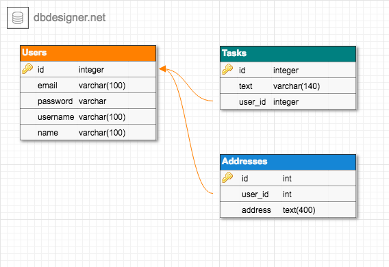

# Code Express ORM MariaDB

Express-based REST API server with ORM and MariaDB/MySQL.

---

## Preparation

### Database Installation

**macOS:**

```sh
brew install mariadb
brew services start mariadb
```

**Ubuntu:**

- [Install MariaDB 10.3 on Ubuntu 18.04 and CentOS 7 - Computingforgeeks](https://computingforgeeks.com/install-mariadb-10-on-ubuntu-18-04-and-centos-7)
- [How To Install MySQL on Ubuntu 18.04 | DigitalOcean](https://www.digitalocean.com/community/tutorials/how-to-install-mysql-on-ubuntu-18-04)

## Installation and Configuration

Install dependencies:

```sh
yarn
```

Run `setup` script:

```sh
yarn setup
# this will copy .env.schema to .env
```

Then edit `.env` contents in your editor:

```conf
DB_USERNAME=yourusername
DB_PASSWORD=yourpassword
DB_NAME=yourdatabase
DB_HOST=localhost
DB_PORT=3306
DB_DIALECT=mysql
```

Create the `yourdatabase` (change this) database to your own database server.

Run `migrate` script to migrate the tables and seed data into the database.

```sh
yarn migrate
```

---

## Running

### Development

```sh
yarn dev
```

### Production

```sh
yarn start
```

---

## Extra Information

### REST API Endpoints

| Endpoint     | HTTP   | Description           |
| ------------ | ------ | --------------------- |
| `/`          | GET    | Get root API          |
| `/users`     | GET    | Get all users         |
| `/users/:id` | GET    | Get one user by id    |
| `/users`     | POST   | Create new user       |
| `/users/:id` | PUT    | Update one user by id |
| `/users/:id` | DELETE | Delete one user by id |
| `/users`     | DELETE | Delete all users      |

**Request body example**

```json
{
  "email": "yourname@yourdomain.com",
  "password": "yourpassword",
  "username": "yourusername",
  "name": "Your Full Name"
}
```

### Data Schema



**Users**

```json
{
  "id": 0,
  "email": "",
  "password": "",
  "salt": "",
  "username": "",
  "name": ""
}
```

**Tasks**

```json
{
  "id": 0,
  "user_id": 0,
  "text": ""
}
```

### How to Use Sequelize

Follow this official guide: <http://docs.sequelizejs.com/manual/tutorial/migrations.html>

Install `sequelize` dependencies in your project.

```sh
yarn add sequelize mysql2 mariadb sqlite
```

Use `sequelize-cli` to initialize and configure the project.

```sh
# install sequelize-cli globally
yarn global add sequelize-cli sequelize mysql2 mariadb sqlite

# so you can use it anywhere
sequelize init

# change config.json to config.js

# change '/../config/config.js' in models/index.js

# configure config.js based on your database settings
# change database name, username, password, host, port, dialect

# generate model via cli
sequelize model:generate --name User --attributes username:string,email:string

# edit migrations file
# migrations/20180000000000-create-user.js

# edit models file
# models/user.js

# do the migration from the configuration to the actual database
sequelize db:migrate

# generate seeder via cli
sequelize seed:generate --name demo-users

# edit seeders file
# seeders/20180000000000-demo-users.js

# do the seeding from the configuration to the actual database
sequelize db:seed:all
```

### How to Integrate with Express

Change the `server.listen` code block.

```js
server.listen(port, function() {
  console.log('Express server listening on port ' + server.address().port);
});
server.on('error', onError);
server.on('listening', onListening);
```

Into this, to be wrapped with `models.sequelize`.

```js
const models = require('./models');

// ...

models.sequelize.sync().then(function() {
  server.listen(port, function() {
    console.log('Express server listening on port ' + server.address().port);
    debug('Express server listening on port ' + server.address().port);
  });
  server.on('error', onError);
  server.on('listening', onListening);
});
```

Use the model from anywhere. For instance, in your controller functions.

```js
const models = require('../../models');

// ...

models.User.findAll()
  .then(users => {
    res.send({
      users
    });
  })
  .catch(error => {
    res.status(400).send({
      error
    });
  });
```

Run `express` server as usual.

### Database Dump

How to backup/export & restore/import database from/to a file.

**Export:**

```sh
mysqldump yourdatabase --single-transaction --user=yourusername -p > yourfile.sql
```

**Import:**

```sh
mysql yourdatabase --user=yourusername -p < yourfile.sql
```
